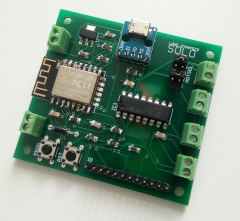
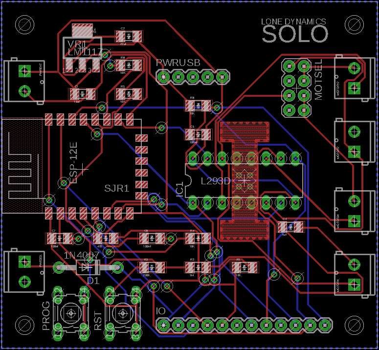
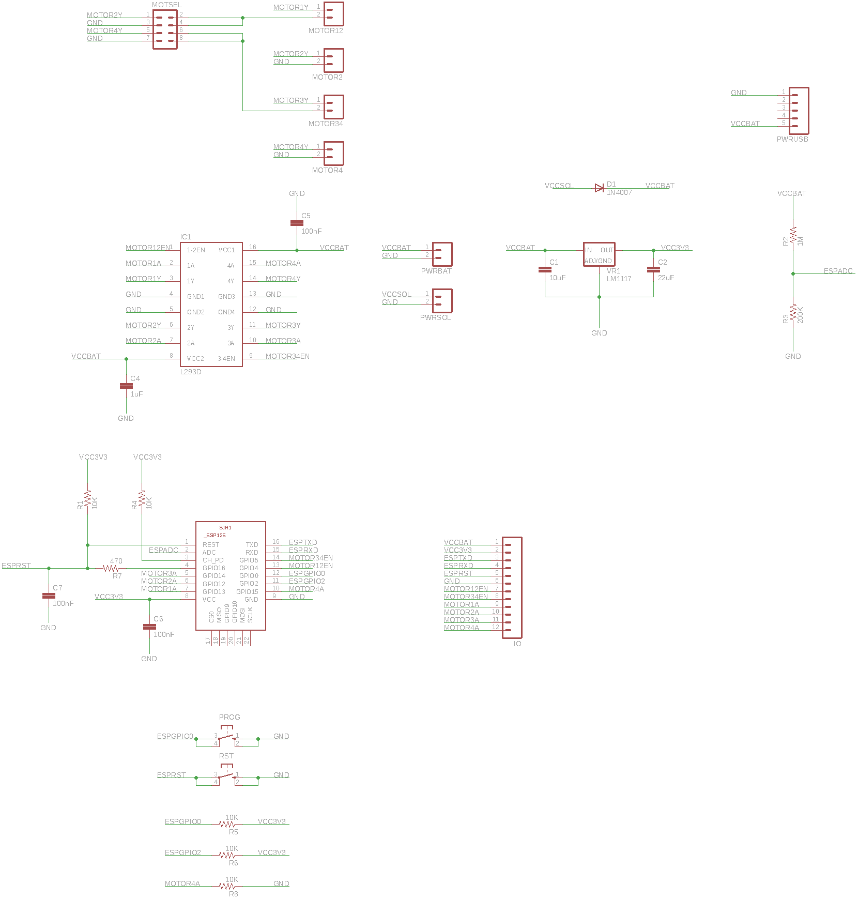

# SOLO IOT motor controller

## Overview

SOLO is an IOT motor controller board designed by Lone Dynamics.

## Features

  * Supports ESPEasy to provide a web-based interface and MQTT support over WiFi
  * Controls 2 (bidirectional) or 4 (unidirectional) DC motors
  * Power via MicroUSB or batteries and a solar panel
  * Battery voltage monitoring
  * Hand-solderable with a soldering iron

## Specifications

| | |
| --- | --- |
| Dimensions | 65mm x 60mm |
| WiFi Module | ESP-12E or F |
| Motor Controller | L293D |
| Power | MicroUSB, 4xAA NiMH batteries, 6V solar panel |

## Header Pinout

| Pin | Function |
| --- | --- |
| 1 | VCCBAT |
| 2 | VCC3V3 |
| 3 | ESPTXD |
| 4 | ESPRXD |
| 5 | ESPRST |
| 6 | GND |
| 7 | MOTOR12EN |
| 8 | MOTOR34EN |
| 9 | MOTOR1A |
| 10 | MOTOR2A |
| 11 | MOTOR3A |
| 12 | MOTOR4A |

## Board

## Schematics

## Known Issues (revision 0)

  * Pull-down resistors (10K) should be added to MOTOR12EN and MOTOR34EN to prevent the L293D from being enabled while the ESP is in sleep mode
  * Heatsink cutout doesn't expose copper
  * Has no built-in battery over-voltage protection 

